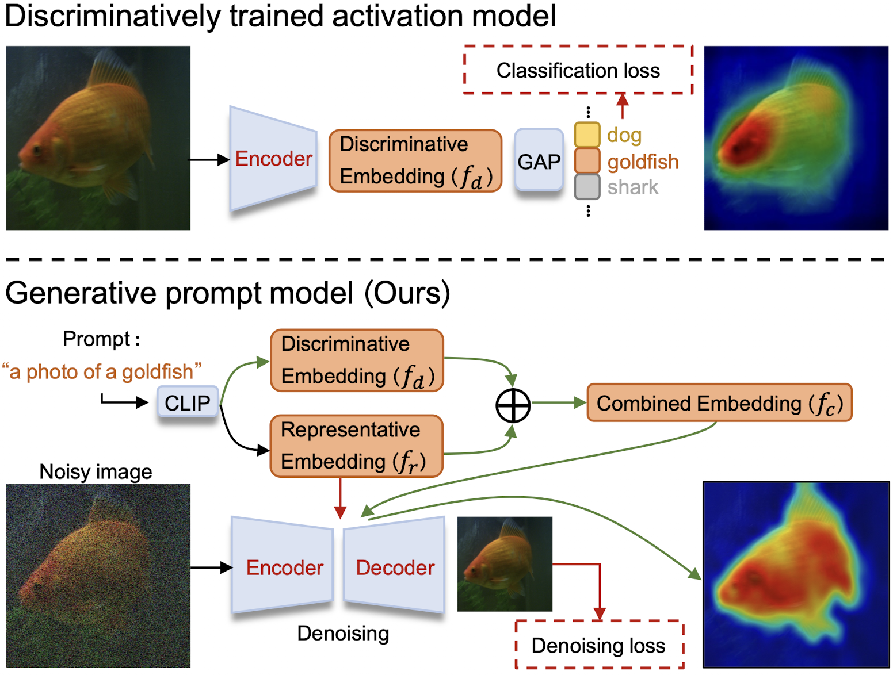
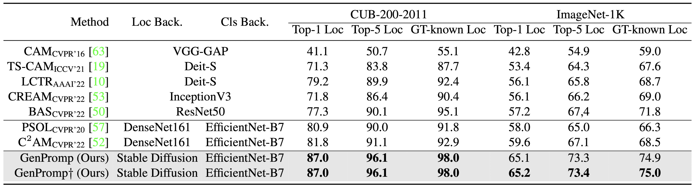
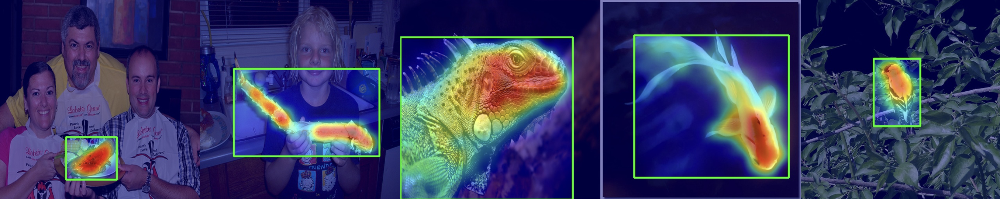

<div align=center>
  
# Generative Prompt Model for Weakly Supervised Object Localization [ICCV'23]
</div>

<div align=center>
  
  <p >This is the official implementaion of paper [***Generative Prompt Model for Weakly Supervised Object Localization***](https://arxiv.org/abs/2307.09756), which is accepted as ***ICCV 2023***.

This repository contains Pytorch training code, evaluation code, pre-trained models, and visualization method.</p>
</div>

<div align=center>
  
[](https://arxiv.org/abs/2307.09756)


[](LICENSE)
</div>

<div align=center>
  

</div>

## 1. Contents
- [Generative Prompt Model for Weakly Supervised Object Localization]
  - [1. Contents](#1-contents)
  - [2. Introduction](#2-introduction)
  - [3. Results](#3-results)
  - [4. Get Start](#4-get-start)
    - [4.1 Installation](#41-installation)
    - [4.2 Dataset and Files Preparation](#42-dataset-and-files-preparation)
    - [4.3 Training](#43-training)
    - [4.4 Inference](#44-inference)
    - [4.5 Extra Options](#45-extra-options)
  - [5. License](#5-license)
  - [6. Contacts](#6-contacts)
  - [7. Acknowledgment](#7-acknowledgment)
  - [8. Citation](#8-citation)

## 2. Introduction

Weakly supervised object localization (WSOL) remains challenging when learning object localization models from image category labels. Conventional methods that discriminatively train activation models ignore representative yet less discriminative object parts. In this study, we propose a generative prompt model (GenPromp), defining the first generative pipeline to localize less discriminative object parts by formulating WSOL as a conditional image denoising procedure. During training, GenPromp converts image category labels to learnable prompt embeddings which are fed to a generative model to conditionally recover the input image with noise and learn representative embeddings. During inference, GenPromp combines the representative embeddings with discriminative embeddings (queried from an off-the-shelf vision-language model) for both representative and discriminative capacity. The combined embeddings are finally used to generate multi-scale high-quality attention maps, which facilitate localizing full object extent. Experiments on CUB-200-2011 and ILSVRC show that GenPromp respectively outperforms the best discriminative models, setting a solid baseline for WSOL with the generative model.


## 3. Results

<div align=center>
  

</div>

## 4. Get Start

### 4.1 Installation

To setup the environment of GenPromp, we use `conda` to manage our dependencies. Our developers use `CUDA 11.3` to do experiments. Run the following commands to install GenPromp:
 ```
conda create -n gpm python=3.8 -y && conda activate gpm
pip install --upgrade pip
pip install torch==1.11.0+cu113 torchvision==0.12.0+cu113 torchaudio==0.11.0 --extra-index-url https://download.pytorch.org/whl/cu113
pip install --upgrade diffusers[torch]==0.13.1
pip install transformers==4.29.2 accelerate==0.19.0
pip install matplotlib opencv-python OmegaConf tqdm
 ```

### 4.2 Dataset and Files Preparation
To train GenPromp with pre-training weights and infer GenPromp with the given weights, download the files in the table and arrange the files according to the file tree below. (Uploading)


  | Dataset & Files                        | Download                                                               | Usage                                                                 |
  | -------------------------------------- | ---------------------------------------------------------------------- | --------------------------------------------------------------------- |
  | data/ImageNet_ILSVRC2012 (146GB)            | [Official Link](http://image-net.org/)                        | Benchmark dataset                                                     |
  | data/CUB_200_2011 (1.2GB)                   | [Official Link](http://www.vision.caltech.edu/datasets/cub_200_2011/)      | Benchmark dataset                                        |
  | ckpts/pretrains (5.2GB)                | [Official Link](), [Google Drive](), [Baidu Drive]()          | Stable Diffusion pretrain weights                                     |
  | ckpts/classifications (1.2GB)          | [Google Drive](), [Baidu Drive]()                                      | Classfication results on benchmark datasets                           |
  | ckpts/imagenet750 (3.3.GB)             | [Google Drive](), [Baidu Drive]()                                      | Weights that achieves 75.0% GT-Known Loc on ImageNet                  |
  | ckpts/cub980 (832KB)                   | [Google Drive](), [Baidu Drive]()                                      | Weights that achieves 98.0% GT-Known Loc on CUB                       |

```text
    |--GenPromp/
      |--data/
        |--ImageNet_ILSVRC2012/
           |--ILSVRC2012_list/
           |--train/
           |--val/
        |--CUB_200_2011
           |--attributes/
           |--images/
           ...
      |--ckpts/
        |--pretrains/
          |--stable-diffusion-v1-4/
        |--classifications/
          |--cub_efficientnetb7.json
          |--imagenet_efficientnet-b7_3rdparty_8xb32-aa-advprop_in1k.json
        |--imagenet750/
          |--tokens/
          |--unet/
        |--cub980/
          |--tokens/
      |--configs/
      |--datasets
      |--models
      |--main.py
```


### 4.3 Training

Here is a training example of GenPromp on ImageNet.
```
accelerate config
accelerate launch python main.py --function train_token --config configs/imagenet.yml --opt "{'train': {'save_path': 'ckpts/imagenet/'}}"
accelerate launch python main.py --function train_unet --config configs/imagenet_stage2.yml --opt "{'train': {'load_token_path': 'ckpts/imagenet/tokens/', 'save_path': 'ckpts/imagenet/'}}"
```
`accelerate` is used for multi-GPU training. In the first training stage, the weights of concept tokens of the representative embeddings are learned and saved to `ckpts/imagenet/`. In the second training stage, the weights of the learned concept tokens are loaded from `ckpts/imagenet/tokens/`, then the weights of the UNet are finetuned and saved to `ckpts/imagenet/`. Other configurations can be seen in the config files (i.e. `configs/imagenet.yml` and `configs/imagenet_stage2.yml`) and can be modified by `--opt` with a parameter dict.

Here is a training example of GenPromp on CUB_200_2011.
```
accelerate config
accelerate launch python main.py --function train_token --config configs/cub.yml --opt "{'train': {'save_path': 'ckpts/cub/'}}"
accelerate launch python main.py --function train_unet --config configs/cub_stage2.yml --opt "{'train': {'load_token_path': 'ckpts/cub/tokens/', 'save_path': 'ckpts/cub/'}}"
```

### 4.4 Inference
Here is a inference example of GenPromp on ImageNet.

```
python main.py --function test --config configs/imagenet_stage2.yml --opt "{'test': {'load_token_path': 'ckpts/imagenet750/tokens/', 'load_unet_path': 'ckpts/imagenet750/unet/', 'save_log_path': 'ckpts/imagnet750/log.txt'}}"
```
In the inference stage, the weights of the learned concept tokens are load from `ckpts/imagenet750/tokens/` , the weights of the finetuned UNet are load from `ckpts/imagenet750/unet/` and the log file is saved to `ckpts/imagnet750/log.txt`. Due the random noise added to the tested image and the batch size, the results might fluctuate within a small range ($\pm$ 0.1).

Here is a inference example of GenPromp on CUB_200_2011.
```
python main.py --function test --config configs/cub.yml --opt "{'test': {'load_token_path': 'ckpts/cub980/tokens/', 'save_log_path': 'ckpts/cub980/log.txt'}}"
```

### 4.5 Extra Options

There are many extra options during training and inference. The default option is configured in the `yml` file. We can use `--opt` to add or override the default option with a parameter dict. Here are some usage of the most commonly used options.

  | Option | Scope | Usage |
  | -------| ----- | ----- |
  | {'data': {'keep_class': [0, 9]}}                            | data              | keep the data with category id in `[0, 1, 2, 3, ..., 9]`            |
  | {'train': {'batch_size': 2}}                                | train             | train with batch size `2`.                                          |
  | {'train': {'num_train_epochs': 1}}                          | train             | train the model for `1` epoch.                                      |
  | {'train': {'save_steps': 200}}                              | train_unet        | save trained UNet every `200` steps.                                |
  | {'train': {'max_train_steps': 600}}                         | train_unet        | terminate training within `600` steps.                              |
  | {'train': {'gradient_accumulation_steps': 2}}               | train             | batch size `x2` when the memory of GPU is limited.                  |
  | {'train': {'learning_rate': 5.0e-08}}                       | train             | the learning rate is `5.0e-8`.                                      |
  | {'train': {'scale_lr': True}}                               | train             | the learning rate is multiplied with batch size if `True`.          |
  | {'train': {'load_pretrain_path': 'stable-diffusion/'}}      | train             | the pretrained model is load from `stable-diffusion/`.              |
  | {'train': {'load_token_path': 'ckpt/tokens/'}}              | train             | the trained concept tokens are load from `ckpt/tokens/`.            |
  | {'train': {'save_path': 'ckpt/'}}                           | train             | save the trained weights to `ckpt/`.                                |
  | {'test': {'batch_size': 2}}                                 | test              | test with batch size `2`.                                           |
  | {'test': {'cam_thr': 0.25}}                                 | test              | test with cam threshold `0.25`.                                     |
  | {'test': {'combine_ratio': 0.6}}                            | test              | combine ratio between $f_r$ and $f_d$ is `0.6`.                     |
  | {'test': {'load_class_path': 'imagenet_efficientnet.json'}} | test              | load classification results from `imagenet_efficientnet.json`.      |
  | {'test': {'load_pretrain_path': 'stable-diffusion/'}}       | test              | the pretrained model is load from `stable-diffusion/`.              |
  | {'test': {'load_token_path': 'ckpt/tokens/'}}               | test              | the trained concept tokens are load from `ckpt/tokens/`.            |
  | {'test': {'load_unet_path': 'ckpt/unet/'}}                  | test              | the trained UNet is load from `ckpt/unet/`.                         |
  | {'test': {'save_vis_path': 'ckpt/vis/'}}                    | test              | the visualized predictions are saved to `ckpt/vis/`.                |
  | {'test': {'save_log_path': 'ckpt/log.txt'}}                 | test              | the log file is saved to `ckpt/log.txt`.                            |
  | {'test': {'eval_mode': 'top1'}}                             | test              | `top1` denotes evaluating the predicted top1 cls category of the test image, `top5` denotes evaluating the predicted top5 cls category of the test image, `gtk` denotes evaluating the gt category of the test image, which can be tested without the classification result. We use `top1` as the default eval mode.  |   

These options can be combined by simplely merging the dicts. For example, if you want to evaluate GenPromp with config file `configs/imagenet_stage2.yml`, with categories `[0, 1, 2, ..., 9]`, concept tokens load from `ckpts/imagenet750/tokens/`, UNet load from `ckpts/imagenet750/unet/`, log file of the evaluated metrics saved to `ckpts/imagnet750/log0-9.txt`, combine ratio equals to `0`, visualization results saved to `ckpts/imagenet750/vis`, using the following command:

```
python main.py --function test --config configs/imagenet_stage2.yml --opt "{'data': {'keep_class': [0, 9]}, 'test': {'load_token_path': 'ckpts/imagenet750/tokens/', 'load_unet_path': 'ckpts/imagenet750/unet/', 'save_log_path':'ckpts/imagnet750/log.txt', 'combine_ratio': 0, 'save_vis_path': 'ckpts/imagenet750/vis'}}"
```

<div align=center>
  

</div>
    
## 5. License

- The repository is released under the MIT license.

## 6. Contacts
If you have any question about our work or this repository, please don't hesitate to contact us by emails.
- [zhaoyuzhong20@mails.ucas.ac.cn](zhaoyuzhong20@mails.ucas.ac.cn)
- [wanfang@ucas.ac.cn](wanfang@ucas.ac.cn)

You can also open an issue under this project.

## 7. Acknowledgment

- Part of the code is borrowed from [TS-CAM](https://github.com/vasgaowei/TS-CAM), [diffusers](https://github.com/huggingface/diffusers), and [prompt-to-prompt](https://github.com/google/prompt-to-prompt/), we sincerely thank them for their contributions to the community.


## 8. Citation

```text
@article{zhao2023generative,
  title={Generative Prompt Model for Weakly Supervised Object Localization},
  author={Zhao, Yuzhong and Ye, Qixiang and Wu, Weijia and Shen, Chunhua and Wan, Fang},
  journal={arXiv preprint arXiv:2307.09756},
  year={2023}
}
```
